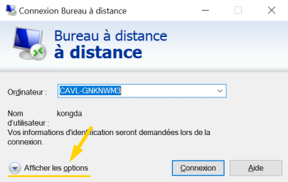
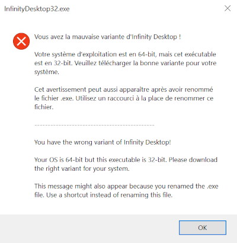

Infinity Desktop enables fast multi monitor selection for Windows' [Remote Desktop Connection][rdc]. This app is based on [Scott Hanselman's blog post][blog] and [djwork's PowerShell script][script].

<table>
   <thead>
      <tr>
         <th colspan=2>Language of Documentation</th>
      </tr>
   </thead>
   <tbody>
      <tr>
         <td align="center"><a href="https://github.com/DaraJKong/Infinity-Desktop">Français</a></td>
         <td align="center"><a href="https://github.com/DaraJKong/Infinity-Desktop/blob/main/README.en.md">English</a></td>
      </tr>
   </tbody>
</table>

#### Table of Contents

1. [Features](#features)
2. [Installation](#installation)
3. [How To Use](#how-to-use)
   - [Settings](#settings)
   - [Default RDP Settings](#default-rdp-settings)
4. [Troubleshooting](#troubleshooting)
   - [Microsoft Defender SmartScreen's Warning](#microsoft-defender-smartscreens-warning)
   - [Error: Wrong Variant](#error-wrong-variant)
5. [Uninstallation](#uninstallation)
6. [Technical Informations](#technical-informations)
7. [TODO](#todo)
8. [Useful Resources](#useful-resources)

# Features

- Provides fast and easy selection of multiple monitors when using RDC
- Remembers the last selected monitors
- Allows customization of essential settings through a configuration file
- Easy installation

# Installation

1. Download the correct executable file according to your OS ([32-bit or 64-bit][nbit]):

   | Version                    | Operating System  | Download URL       |
   | -------------------------- | ----------------- | ------------------ |
   | [v1.2.0-beta][v3] (latest) | Windows 10 32-bit | [Download][v3url1] |
   |                            | Windows 10 64-bit | [Download][v3url2] |
   | [v1.1.2-beta][v2]          | Windows 10 32-bit | [Download][v2url1] |
   |                            | Windows 10 64-bit | [Download][v2url2] |
   | [v1.0.0.3-beta][v1]        | Windows 10 32-bit | [Download][v1url1] |
   |                            | Windows 10 64-bit | [Download][v1url2] |

2. Make sure you have [Remote Desktop Connection][rdc] installed and follow the steps to enable the feature on Windows. This step can be skipped in most cases as it's installed by default.

3. Open the executable you downloaded.

4. If a warning popup appears, please refer to the [Troubleshooting](#troubleshooting) section to overcome it.

5. Optionally, you can create a desktop shortcut and pin it to the taskbar.

# How To Use

To connect to your remote desktop using multiple monitors, double-click on the executable file to open it. All of your screens will turn black for a moment and once everything is loaded, you will see numbers appearing on each monitor. These numbers represent the monitors' IDs.

Left-click on any screen to select or unselect it. A yellow background means the monitor is selected for the remote connection. Monitors you don't select will be used for your current computer. Once you are satisfied with your setup, simply press the Enter key or the Space key. The screens will go back to normal as the remote connection is starting using a custom RDP file.

To cancel the remote connection, you can press the Escape key, the Delete key or the Backspace key.

The app will create a folder named "Infinity Desktop" in the directory "C:\\Users\\{USERNAME}\\AppData\\Roaming\\." You will find a useful configuration file in it where settings are stored. Replace "{USERNAME}" with your actual username to find the right folder, because the path varies depending on who is using the computer.

## Settings

To consult or modify Infinity Desktop's parameters, open the configuration file "C:\\Users\\{USERNAME}\\AppData\\Roaming\\Infinity Desktop\\config.ini" in a text editor (Notepad or Notepad++). To quickly navigate to the folder, you can enter "%APPDATA%" in the input field at the top of the Windows Explorer. This shortcut will bring you directly to "C:\\Users\\{USERNAME}\\AppData\\Roaming\\." Otherwise, simply replace "{USERNAME}" with your username in the path.

#### **Fullscreen**

> Sets whether the screen overlays are displayed in fullscreen or not (only for the monitor selection app). Set to 1 for the app to be in fullscreen mode or 0 to show the taskbar while selecting the screens.

#### **EditConnection**

> If set to 1, the remote connection will enable you to edit the settings before proceding. Set to 0 if you want to skip that step and save time. It is recommended to save your remote connection settings to the "Default.rdp" file (see the [Default RDP Settings](#default-rdp-settings) section) before disabling this setting, because it ensures you always connect with the right configuration.

## Default RDP Settings

The "Default.rdp" file is created by default by the [Remote Desktop Connection][rdc] software. It is hidden and located into your Documents folder ("C:\\Users\\{USERNAME}\\Documents\\Default.rdp"). Infinity Desktop will always pull settings from this file so make sure you save your favorite options there. For information only, the file is duplicated and placed into "C:\\Users\\{USERNAME}\\AppData\\Roaming\\Infinity Desktop\\custom.rdp."

If you want to save time, it is recommended that you save your preferences in that file. This can be done with the same [Remote Desktop Connection][rdc] software. Simply click on "Afficher les options," change the parameters you want, enter your username (optionnal), and click on "Enregistrer."

# Troubleshooting

## Microsoft Defender SmartScreen's Warning

For security reasons, [Microsoft Defender SmartScreen][msdss] will sometimes prevent you from running an untrusted application. If you trust the app and want to bypass the warning, click on "More info," and then "Run anyway."

## Error: Wrong Variant

If the following message appears after attempting to open the executable file, it means you didn't download the right Infinity Desktop version. Please check if your OS is [32-bit or 64-bit][nbit] and download the correct executable.

Renaming the .exe file can also trigger this error. The name of the executable has to end with either 32 or 64 to indicate the variant. If you don't like the file's name, simply create a shortcut to place on the desktop or taskbar instead of renaming the executable.

# Uninstallation

To uninstall Infinity Desktop manually, you need to delete the folder "C:\\Users\\{USERNAME}\\AppData\\Roaming\\Infinity Desktop\\," the executable file and the shortcuts created by you (Desktop, Taskbar, Start menu). The program only ever modifies the folder mentioned above and the registry key "HKCU\\AppEvents\\Schemes\\Apps\\.Default\\SystemAsterisk\\.Current" in a temporary manner. So, no need to worry about it as the key is always put back to its previous value.

# Technical Informations

The AutoHotkey version currently used for the main branch of this project is [2.0-beta.8](https://github.com/Lexikos/AutoHotkey_L/tree/alpha).

# TODO

- [ ] Enable user to change settings easily
- [ ] How to use tips and ~~shortcuts reminder~~, URL to Github
- [ ] Notify user when selected monitors are of different resolutions and might not give expected results
- [ ] Easy remembering, saving, managing of RDP config and settings files, reload settings automatically
- [ ] Workaround for not able to select monitors of different resolutions
- [ ] Workaround for the resolution scaling being off sometimes (additional feature)
- [ ] Remember relative positions of selected monitors (main monitor, left, middle, right, first, last) and implement universal pattern that adapts when number of monitors is not the same (in addition to remembering IDs)
- [ ] Create automatic installer and uninstaller

# Useful Resources

- Scott Hanselman wrote an excellent article explaining how to configure a custom .rdp file for using RDC with some monitors: https://www.hanselman.com/blog/how-to-remote-desktop-fullscreen-rdp-with-just-some-of-your-multiple-monitors
- Thanks to djwork on superuser.com for his PowerShell script that grabs the output of Windows message box and saves it to a string: https://superuser.com/questions/1695016/grabbing-the-output-of-windows-message-box-to-a-string

[blog]: https://www.hanselman.com/blog/how-to-remote-desktop-fullscreen-rdp-with-just-some-of-your-multiple-monitors
[script]: https://superuser.com/questions/1695016/grabbing-the-output-of-windows-message-box-to-a-string
[rdc]: https://support.microsoft.com/en-us/windows/how-to-use-remote-desktop-5fe128d5-8fb1-7a23-3b8a-41e636865e8c
[msdss]: https://docs.microsoft.com/en-us/windows/security/threat-protection/microsoft-defender-smartscreen/microsoft-defender-smartscreen-overview
[nbit]: https://support.microsoft.com/en-us/windows/32-bit-and-64-bit-windows-frequently-asked-questions-c6ca9541-8dce-4d48-0415-94a3faa2e13d
[v3]: https://github.com/DaraJKong/Infinity-Desktop/releases/tag/v1.2.0-beta
[v3url1]: https://github.com/DaraJKong/Infinity-Desktop/releases/download/v1.2.0-beta/InfinityDesktop32.exe
[v3url2]: https://github.com/DaraJKong/Infinity-Desktop/releases/download/v1.2.0-beta/InfinityDesktop64.exe
[v2]: https://github.com/DaraJKong/Infinity-Desktop/releases/tag/v1.1.2-beta
[v2url1]: https://github.com/DaraJKong/Infinity-Desktop/releases/download/v1.1.2-beta/InfinityDesktop32.exe
[v2url2]: https://github.com/DaraJKong/Infinity-Desktop/releases/download/v1.1.2-beta/InfinityDesktop64.exe
[v1]: https://github.com/DaraJKong/Infinity-Desktop/releases/tag/v1.0.0.3-beta
[v1url1]: https://github.com/DaraJKong/Infinity-Desktop/releases/download/v1.0.0.3-beta/InfinityDesktop32.exe
[v1url2]: https://github.com/DaraJKong/Infinity-Desktop/releases/download/v1.0.0.3-beta/InfinityDesktop64.exe
