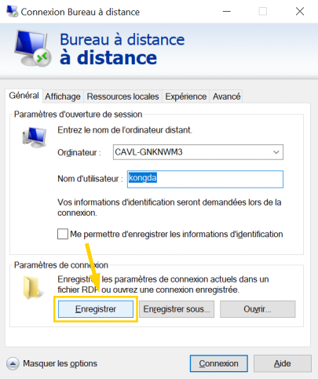

Infinity Desktop permet la sélection rapide de plusieurs écrans pour la [Remote Desktop Connection][rdc] de Windows. Cette application est basée sur cet [article de Scott Hanselman][blog].

Are you looking for the [English documentation][endocs]?

#### Table des matières

1. [Fonctionnalités](#fonctionnalités)
2. [Installation](#installation)
3. [Guide d'utilisation](#guide-dutilisation)
   - [Configuration](#configuration)
   - [Paramètres RDP par défaut](#paramètres-rdp-par-défaut)
4. [Dépannage](#dépannage)
   - [Avertissement de Microsoft Defender SmartScreen](#avertissement-de-microsoft-defender-smartscreen)
   - [Erreur : mauvaise variante](#erreur-mauvaise-variante)
5. [Désinstallation](#désinstallation)
6. [À FAIRE](#à-faire)

# Fonctionnalités

- Permet la sélection rapide de plusieurs écrans lors de la connection à un bureau à distance
- Se souvient des écrans précédemment sélectionnés
- Est personnalisable grâce à un fichier de configuration
- Installation facile

# Installation

1. Téléchargez la bonne variante du fichier exécutable en fonction de votre système ([32 ou 64 bits][nbit]) :

   | Version             | Système d'exploitation | URL de téléchargement |
   | ------------------- | ---------------------- | --------------------- |
   | [v1.0.0.3-beta][v1] | Windows 10 32-bit      | [Télécharger][v1url1] |
   |                     | Windows 10 64-bit      | [Télécharger][v1url2] |

2. Si RDC est déjà installé et activé, sautez cette étape. Suivez le lien suivant afin d'installer et/ou activer [Remote Desktop Connection][rdc].

3. Ouvrez l'exécutable que vous avez téléchargé.

4. Si un message d'avertissement apparaît, veuillez vous référer à la section [Dépannage](#dépannage).

# Guide d'utilisation

Pour vous connecter à votre bureau à distance en utilisant plusieurs écrans, boucle-cliquez sur le fichier exécutable afin de l'ouvrir. Chacun de vos écrans va devenir noir pendant un moment, le temps que l'application charge, puis chaque d'eux affichera un chiffre représentant son numéro d'identification.

Faites un clic gauche sur n'importe quel écran pour le sélectioner ou le désélectionner. Un fond d'écran jaune signifie que l'écran sera utilisé pour l'ordinateur à distance. Les moniteurs non sélectionnés vont servir pour votre ordinateur portable (ou l'ordinateur que vous utilisez en ce moment). Lorsque vous êtes satisfait, appuyez sur la touche Entrer (Enter) ou la Barre d'espace. Les écrans vont retrouver leur état naturel et la connection à distance va s'ouvrir en utilisant les paramètres d'un fichier RDP personnalisé.

Pour annuler la connection à distance, il suffit d'appuyer sur la touche Échap (ESC), la touche Supprimer (DEL) ou la touche Retour arrière (Backspace).

L'application va créer un dossier nommé « Infinity Desktop » dans votre répertoire « C:\\Users\\{NOM D'UTILISATEUR}\\AppData\\Roaming\\. » Dans celui-ci, vous trouverez un fichier de configuration assez utile où les paramètres de l'application sont enregistrés. Remplacez « {NOM D'UTILISATEUR} » par votre nom d'utilisateur pour trouver dossier, car le chemin varie en fonction de qui utilise l'ordinateur.

## Configuration

Pour modifier ou consulter les paramètres d'Infinity Desktop, ouvrez le fichier de configuration « C:\\Users\\{NOM D'UTILISATEUR}\\AppData\\Roaming\\Infinity Desktop\\config.ini » dans un éditeur de texte (Bloc-notes ou Notepad++). Afin de naviguer rapidement à votre dossier, vous pouvez entrer « %APPDATA% » dans le champ en haut de l'exploratuer Windows. Ce raccourci vous apportera directement au dossier « C:\\Users\\{NOM D'UTILISATEUR}\\AppData\\Roaming\\. » Sinon, remplacez « {NOM D'UTILISATEUR} » par votre nom d'utilisateur dans le chemin.

#### **Plein écran (Fullscreen)**

> Détermine si l'application (seulement l'application de sélection des écrans) soit en plein écran ou non. Mettre à 1 pour que l'application soit en plain écran ou à 0 pour que la barre des tâches reste visible lors de la sélection des moniteurs.

#### **Édition de la connection (EditConnection)**

> Si ce paramètre est mis à 1, la connection à distance va vous permettre de modifier les options de connection avant de continuer. Mettez à 0 si vous voulez gagner du temps en désactivant la possibilité de modifier les options à chaque fois. Il est recommandé de sauvegarder vos paramètres de connection dans le fichier « Default.rdp » (voir la section [Paramètres RDP par défaut](#paramètres-rdp-par-défaut)) avant de désactiver ce paramètre, car cela vous permettra d'avoir toujours les mêmes options sans avoir à rentrer les informations à chaque fois.

## Paramètres RDP par défaut

Le fichier « Default.rdp » est automatiquement créé par le logiciel [Remote Desktop Connection][rdc]. Il est invisible et est situé dans votre répertoire Documents (« C:\\Users\\{NOM D'UTILISATEUR}\\Documents\\Default.rdp »). Infinity Desktop va copier les options contenues dans ce fichier à chaque utilisation afin d'avoir les derniers paramètres par défaut enregistrés. Pour information seulement, le fichier est dupliqué et est placé dans « C:\\Users\\{NOM D'UTILISATEUR}\\AppData\\Roaming\\Infinity Desktop\\custom.rdp. »

Si vous désirez sauver du temps, il est fortement conseillé d'enregistrer vos préférences dans ce fichier. Cela peut se faire à l'aide du même logiciel de connection [Remote Desktop Connection][rdc]. Il suffit de cliquer sur « Afficher les options, » changer les paramètres au goût, entrer votre nom d'utilisateur et appuyer sur « Enregistrer. »

# Dépannage

## Avertissement de Microsoft Defender SmartScreen

Pour des raisons de sécurité, [Microsoft Defender SmartScreen][msdss] empêche parfois l'exécution d'applications inconnues. Si vous avez confiance en l'auteur de cette application, cliquez sur « Informations complémentaires, » et puis sur « Exécuter quand même. »

## Erreur : mauvaise variante

Si le message ci-dessous apparaît après avoir ouvert le fichier exécutable, c'est que vous n'avez pas téléchargé la bonne version d'Infinity Desktop. Veuillez vérifier si votre système est en [32 ou 64 bits][nbit] et téléchargez le bon exécutable.

Il se peut que le message apparaisse à cause que le fichier .exe a été renommé. Le nom du fichier exécutable doit absolument terminer par 32 ou 64 afin d'indiquer la variante. Si vous n'aimez pas le nom du fichier, créez un raccourci à placer sur le bureau ou sur dans barre des tâches au lieu de renommer l'exécutable.

# Désinstallation

Pour désinstaller manuellement Infinity Desktop, il suffit de supprimer le dosier « C:\\Users\\{NOM D'UTILISATEUR}\\AppData\\Roaming\\Infinity Desktop\\, » puis de supprimer l'exécutable et les raccourcis créés par vous (Bureau, Barre des tâches, Menu démarrer). Le programme ne modifie rien d'autre que le dossier mentionné ci-haut ainsi que la clé de registre « HKCU\\AppEvents\\Schemes\\Apps\\.Default\\SystemAsterisk\\.Current » de façon très temporaire. Alors pas besoin de s'en préoccuper, car la valeur de la clé est toujours restaurée.

# À FAIRE

- Permettre à l'utilisateur de changer facilement les paramètres
- Rappels des raccourcis clavier ainsi que de comment utiliser, URL vers Github
- Notifier l'utilisateur lorsqu'il sélectionne des écrans de différentes résolutions que le résultat peut ne pas être celui désiré
- Sauvegarde, gestion, chargement faciles du fichier de configuration et du fichier de connection
- Solution de contournement pour sélectionner des écrans de différentes résolutions
- Solution de contournement pour que la résolutions et l'échelle des écrans soit toujours correcte
- Se souvenir des positions relatives des écrans (écran principal, gauche, droite, milieu, premier, dernier etc.) et implémenter un algorithme universel qui adapte les numéros lorsqu'ils changent (en plus de se souvenir des numéros d'identification)
- Créer un désinstallateur automatique

[blog]: https://www.hanselman.com/blog/how-to-remote-desktop-fullscreen-rdp-with-just-some-of-your-multiple-monitors
[rdc]: https://support.microsoft.com/fr-fr/windows/utilisation-du-bureau-%C3%A0-distance-5fe128d5-8fb1-7a23-3b8a-41e636865e8c
[msdss]: https://docs.microsoft.com/fr-fr/windows/security/threat-protection/microsoft-defender-smartscreen/microsoft-defender-smartscreen-overview
[nbit]: https://support.microsoft.com/fr-fr/windows/windows-32-et-64-bits-forum-aux-questions-c6ca9541-8dce-4d48-0415-94a3faa2e13d
[endocs]: https://github.com/DaraJKong/Infinity-Desktop/blob/main/README.en.md
[v1]: https://github.com/DaraJKong/Infinity-Desktop/releases/tag/v1.0.0.3-beta
[v1url1]: https://github.com/DaraJKong/Infinity-Desktop/releases/download/v1.0.0.3-beta/InfinityDesktop32.exe
[v1url2]: https://github.com/DaraJKong/Infinity-Desktop/releases/download/v1.0.0.3-beta/InfinityDesktop64.exe
